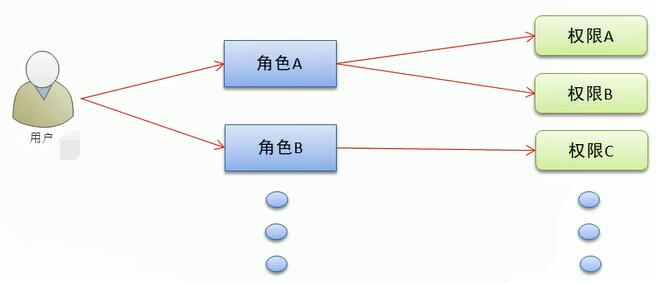
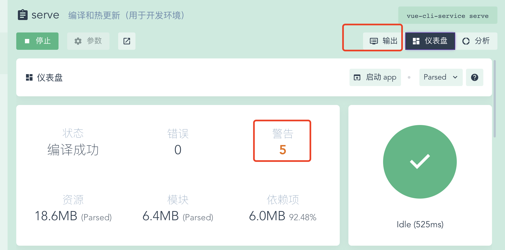
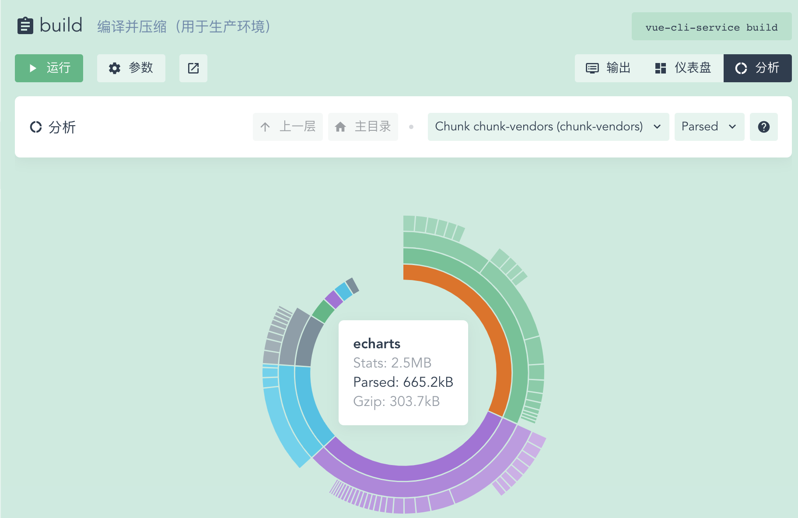

# 使用vue实现的电商管理系统
## 一、目标:
- 能够基于Vue初始化项目;
- 能够基于Vue技术进行项目开发;
- 能够使用Vue的第三方组件进行项目开发;
- 能够说出前后端分离的开发模式;

## 二、项目概述:
- 客户使用的业务服务：PC端，小程序，移动web，移动app
- 管理员使用的业务服务：PC后台管理端。
- PC后台管理端的功能：管理用户账号（登录，退出，用户管理，权限管理），商品管理（商品分类，分类参数，商品信息，订单），数据统计


- 电商后台管理系统采用前后端分离的开发模式
- 前端项目是基于Vue的SPA（单页应用程序）项目

- 前端技术栈:Vue,Vue-Router,Element-UI,Axios,Echarts
- 后端技术栈：Node.js,Express,Jwt(模拟session),Mysql,Sequelize(操作数据库的框架)


## 三、项目初始化:

### 1. 初始化前端项目:
- 安装Vue脚手架
- 通过脚手架创建项目
- 配置路由
- 配置Element-UI:在插件中安装，搜索```vue-cli-plugin-element```
- 配置Axios：在依赖中安装,搜索axios(运行依赖)
- 初始化git仓库
- 将本地项目托管到github或者码云中

### 2. 配置后台项目:

```
参考 "电商管理后台API接口文档.md"
```

## 四、登录/退出功能:
### 1. 登录业务流程:
- 在登陆页面输入用户名和密码;
- 调用后台接口进行验证;
- 通过验证之后, 根据后台的响应状态跳转到项目页面;

### 2. 相关技术点:
- http无状态:
- 通过cookie/session记录状态;
- 通过token方式维持状态保持;

**注意:**
- 前后端不存在跨域, 使用cookie/session;
- 前后端存在跨域, 使用token;

## 五、主页布局：


## 六、用户管理模块：
### 1. 权限管理业务分析:
通过权限管理模块控制不同的用户可以进行哪些操作, 具体可以通过角色的方式进行控制, 即每个用户分配一个特定的角色,角色包括不同的权限



## 七、权限管理模块：


## 八、分类管理模块：
商品管理的树形表格是element-ui没有的,所以需要使用```vue-table-with-tree-grid```
在vue-cli的```依赖```中进行安装


## 九、参数管理模块：
商品参数用于**显示商品固定的特征信息**, 可以通过电商平台详情页直观的看到;
- 动态参数:
- 静态属性:


## 十、商品管理模块：
```
npm install v-viewer
```
vue的图片浏览插件

富文本编辑器:
安装依赖(运行依赖) => vue-quill-editor

## 十一、订单管理模块：


## 十二、数据统计模块：
使用```echarts```实现数据报表功能

# 十三、项目优化上线：
## 1. 项目优化策略:
- 生成打包报告;
- 第三方库的CDN加载;
- Element-UI组件按序加载;
- 路由懒加载;
- 首页内容定制;

## 2 添加页面进度条:
使用第三方插件```nprogress```
github: [https://github.com/rstacruz/nprogress](https://github.com/rstacruz/nprogress)

### 2.1 安装:
vue-cli中```依赖 -> 运行依赖```搜索```nprogress```安装即可;
### 2.2 使用:

简单的调用```start```和```done()```来控制进度条
```js
import NProgress from 'nprogress'

NProgress.start();
NProgress.done();
```
在本项目中, 用过在ajax拦截器中使用调用```start```和```done()```:
```js
./main.js

...
// 导入nprogress
import NPrpgress from 'nprogress'
import 'nprogress/nprogress.css'

axios.defaults.base = 'http://127.0.0.1:8888/api'
// 在request拦截器中展示进度条
axios.interceptors.request.use(config => {
  ...
  NPrpgress.start()
  return config
})
// 在response中隐藏进度条
axios.interceptors.response.use(config => {
  NPrpgress.done()
  return config
})
Vue.prototype.$http = axios
Vue.config.productionTip = false

...
```
## 3. 解决开发打包运行中的```警告```:


## 4. 解决生产打包过程中的```警告```:

### 4.1 使用```babel-plugin-transform-remove-console```解决生产打包不允许代码出现console.log:
[https://www.npmjs.com/package/babel-plugin-transform-remove-console](https://www.npmjs.com/package/babel-plugin-transform-remove-console)
#### a. 安装:
在```vue-cli```中, ```依赖 -> 开发依赖```, 搜索```babel-plugin-transform-remove-console```并安装;
#### b. 使用:

```js
./babel.config.js
// 项目发布阶段需要用到的babel插件
const prodPlugins = []
if (process.env.NODE_ENV === 'production') {
  // 发布模式
  prodPlugins.push('transform-remove-console')
}
module.exports = {
  presets: [
    ,,,
  ],
  plugins: [
    [
      ,,,
    ],
    // 增加节点, 展开节点
    ...prodPlugins
  ]
}
```

## 5. 生成打包报告:
打包时, 为了直观地发现项目中存在的问题, 可以在打包时生成报告, 生成报告的方式有两种:
- 通过命令行参数的形式生成报告:
```
//report 选项可以生成report.html以帮助分析内容
vue-cli-service build --report
```
- 通过可视化的UI面板直接查看报告:
在可视化面板最后那个, 通过```控制台```和```分析```面板,可以查看



## 6. 通过vue.config.js修改webpack的默认配置:
通过vue-cli 3.0工具生成的项目, 默认隐藏了所有的webpack的配置项, 目的是为了屏蔽项目的配置过程, 让程序员把工作重心, 放到具体功能和业务上来.

如果程序员有修改webpack默认配置的需求, 可以在项目根目录中, 按需创建```webpack.config.js```这个配置文件, 从而对项目的打包发布过程做自定义的配置(具体配置参考:[https://cli.vuejs.org/zh/config/#vue-config-js](https://cli.vuejs.org/zh/config/#vue-config-js))
```js
// ./webpack.config.js

// 这个文件中, 应该导出一个含有自定义配置项的对象
module.export = {
  // 选项
}
```
## 6. 为开发模式与发布模式指定不同的打包入口
默认情况下, vue项目的```开发模式```与```发布模式```公用同一个打包入口(即./src/main.js). 为了将项目的开发过程与发布过程分离, 可以分为两种模式, 各自指定打包的入口文件, 即:
- 开发模式入口: ```./src/main-dev.js```;
- 发布模式入口: ```./src/main-prod.js```;

### 6.1 configureWebpack 和 chainWebpack:
在vue.config.js导出的配置对象, 新增configureWebpack 或 chainWebpack节点, 来自定义webpack的打包配置;
configureWebpack 和 chainWebpack的作用相同, 唯一的区别在于修改webpack配置的方式不同:
- configureWebpack: 通过```操作对象```的方式来修改默认的webpack配置;
- chainWebpack: 通过```连式编程```的方式来修改默认的webpack配置;

### 6.2 通过chainWebpack自定义打包入口:
代码实例:
```js
// ./vue.config.js

module.exports = {
  chainWebpack: config => {
    config.when(process.env.NODE_ENV === 'production', config => {
      config.entry('app').clear().add('./src/main-prod.js')
    })
    config.when(process.env.NODE_ENV === 'development', config => {
      config.entry('app').clear().add('./src/main-dev.js')
    })
  }
}
```

## 7. 通过externals加载外部CDN资源:
默认情况下, 通过import语法导入的第三方依赖资源,最终会被打包到同一个文件中, 从而导致打包成功后的单文件体积的问题;
可以通过webpack的externals节点, 来配置并加载外部的CDN资源. 凡是声明在externals中的第三方依赖包, 都不会被打包;
### a. 修改vue.config.js:
代码示例:
```js
// ./vue.config.js
module.exports = {
  chainWebpack: config => {
    // 发布模式
    config.when(process.env.NODE_ENV === 'production', config => {
      ...
      config.set('externals', {
        vue: 'vue',
        'vue-router': 'VueRouter',
        axios: 'axios',
        lodash: '_',
        echarts: 'echarts',
        nprogress: 'NProgress',
        'vue-quill-editor': 'VueQuillEditor'
      })
    })
    config.when(process.env.NODE_ENV === 'development', config => {
      // 开发模式
      ...
    })
  }
}
```
### b.在./pubilc/index.html文字间头部,添加CDN资源引用:
```html
<!DOCTYPE html>
<html lang="en">
  <head>
    ...

    <link rel="stylesheet" href="https://cdn.staticfile.org/nprogress/0.2.0/nprogress.min.css" />
    <!-- 富文本编辑器 的样式表文件 -->
    <link rel="stylesheet" href="https://cdn.staticfile.org/quill/1.3.4/quill.core.min.css" />
    <link rel="stylesheet" href="https://cdn.staticfile.org/quill/1.3.4/quill.snow.min.css" />
    <link rel="stylesheet" href="https://cdn.staticfile.org/quill/1.3.4/quill.bubble.min.css" />

    <script src="https://cdn.staticfile.org/vue/2.5.22/vue.min.js"></script>
    <script src="https://cdn.staticfile.org/vue-router/3.0.1/vue-router.min.js"></script>
    <script src="https://cdn.staticfile.org/axios/0.18.0/axios.min.js"></script>
    <script src="https://cdn.staticfile.org/lodash.js/4.17.11/lodash.min.js"></script>
    <script src="https://cdn.staticfile.org/echarts/4.1.0/echarts.min.js"></script>
    <script src="https://cdn.staticfile.org/nprogress/0.2.0/nprogress.min.js"></script>
    <!-- 富文本编辑器的 js 文件 -->
    <script src="https://cdn.staticfile.org/quill/1.3.4/quill.min.js"></script>
    <script src="https://cdn.jsdelivr.net/npm/vue-quill-editor@3.0.4/dist/vue-quill-editor.js"></script>
  </head>
  <body>
    ...
  </body>
</html>

```
### c. CDN引用element-ui:
- 在```main-prod.js```中注释掉element-ui按需加载的代码;
- 在```index.html```的头部区域, 通过CDN加载element-ui的js和css样式
```html
<!-- ./build/index.html -->
<!DOCTYPE html>
<html lang="en">
  <head>
    ...
  <!-- element-ui 的 js 文件 -->
  <script src="https://cdn.staticfile.org/element-ui/2.8.2/index.js"></script>
  <!-- element-ui 的样式表文件 -->
  <link rel="stylesheet" href="https://cdn.staticfile.org/element-ui/2.8.2/theme-chalk/index.css" />
  </head>
  <body>
    ...
  </body>
</html>
```

## 8. 首页内容定制化:
不同的打包环境下, 首页内容可能会有所不同, 可以通过插件的方式进行定制, 插件配置如下:
```js
// ./vue.config.js
module.exports = {
  chainWebpack: config => {
    // 发布模式
    config.when(process.env.NODE_ENV === 'production', config => {
      config.plugin('html').tap(args => {
        args[0].isProd = true
        return args
      })
      ...
    })
    config.when(process.env.NODE_ENV === 'development', config => {
      // 开发模式
      config.plugin('html').tap(args => {
        args[0].isProd = false
        return args
      })
      ...
    })
  }
}
```
在index.html中通过参数:
```html
<!-- ./pubilc/index.html -->
<!DOCTYPE html>
<html lang="en">
  <head>
    ...
    <title><%= htmlWebpackPlugin.options.isProd ? '' : 'dev - ' %>电商后台管理系统</title>

    <% if(htmlWebpackPlugin.options.isProd){ %>
      <link rel="stylesheet" href="https://cdn.staticfile.org/nprogress/0.2.0/nprogress.min.css" />
      ...
    <% } %>
  </head>
  <body>
    ...
  </body>
</html>
```